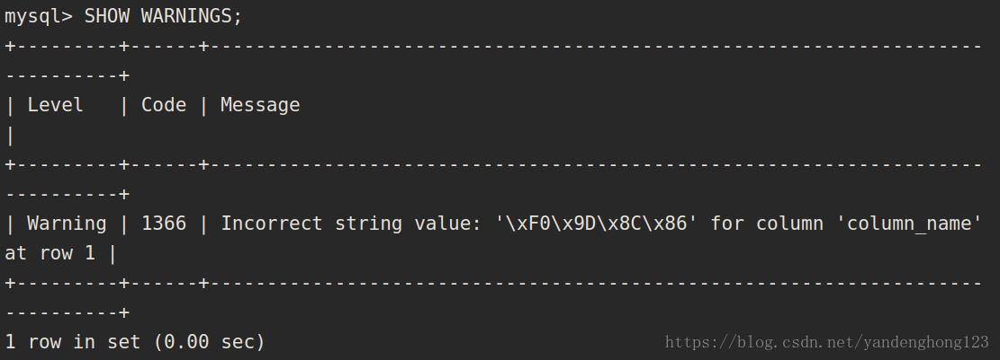
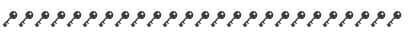
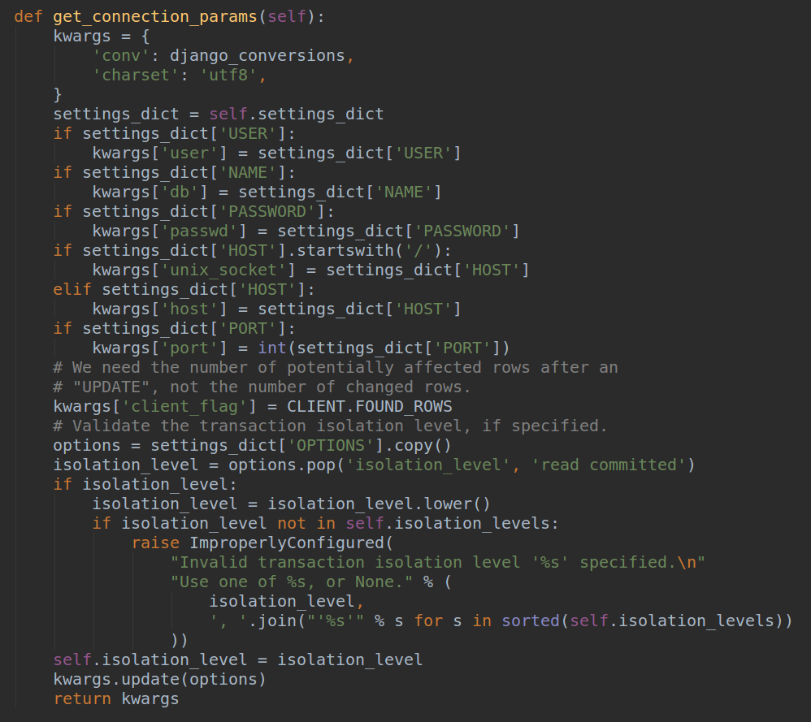
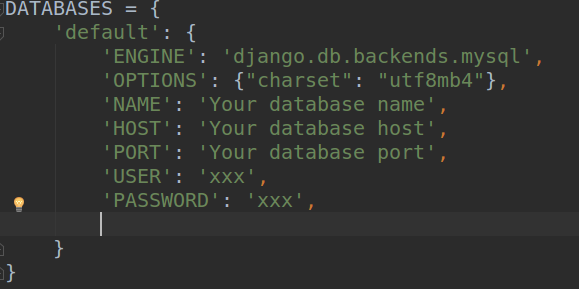

## 前言
最近在向mysql中插入数据时产生了一个错误, 在请教大牛后得到了解决.

## 正文

### 问题

> 图为：向mysql中插入数据时出现的问题

### 分析

> 图为：出错的数据(没错, 是emoji)

这种emoji表情的存储需要mysql版本大于等于5.5.3。

在这个版本之前,mysql的utf8字符集是不完全的,1个字符最大只能占用3个字节存储（比如汉字）。而emoji表情需要用4个字节存储，因此，在向utf8字符集的
mysql插入emoji时会出现上述异常。

### 但是
我在创建mysql库时已经指定了charset=utf8mb4, 还是出现了这个问题。

### 解决
django 获取mysql连接的源码: django/db/backends/mysql/base/DatabaseWrapper

> 图为:django 获取mysql连接的源码

从源码中的'kwargs'可以看到, django和mysql建立的连接默认是utf8字符集, 也就是说,在django中如果要变更连接的字符集,需要显式指定。

> 图为: 显式指定charset

这样修改后, 问题得到了解决。

